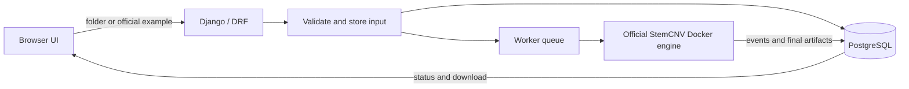

# Stem Graph · Official StemCNV Workflow UI

[](https://github.com/bihealth/StemCNV-check)
[](https://www.djangoproject.com/)
[](https://docs.docker.com/compose/)
[](#important-medical-and-data-notice)

Stem Graph is a browser-based interface for the **official
[StemCNV-check](https://github.com/bihealth/StemCNV-check) engine**. Researchers
can drop in a complete SNP-array dataset, follow its progress, and download a
small result bundle containing the final raw result files and HTML reports.

The application does not replace or reimplement the scientific workflow. It
adds a friendly Django/DRF web interface, validates inputs, starts StemCNV in an
isolated Docker container, records job state in PostgreSQL, and exposes the
finished download only after the engine succeeds.

> **In plain language:** add the DNA-chip files, press Start, wait for the real
> StemCNV workflow, then download its report. If no files are supplied, the
> configured official example dataset is used.

## What the application provides

- One unified drag-and-drop area for files or complete folders
- Clear validation before Docker starts—research files are never mixed with
  example files
- Live progress, a compact event history, and a disabled Start button while a
  run is active
- Persistent run state, inputs, events, and output artifacts in PostgreSQL
- A downloadable ZIP containing researcher-facing results rather than hundreds
  of internal workflow files
- Separate web and worker processes for reliable VM deployment

## Five-step setup

These instructions target a Linux VM. Windows users can use Docker Desktop with
the WSL 2 backend. Allow at least **8 GB RAM** for the scientific worker; real
datasets may require additional memory and disk space.

1. **Install the prerequisites.** Install
   [Git](https://git-scm.com/downloads) and
   [Docker Engine with Compose](https://docs.docker.com/engine/install/). Make
   sure `docker compose version` works.

2. **Download this project.**

   ```bash
   git clone https://github.com/wired87/stem_graph.git
   cd stem_graph
   ```

3. **Create the local configuration.**

   ```bash
   cp .env.example .env
   ```

   Before using real data, open `.env` and replace the example PostgreSQL
   password. All host paths are relative to this repository by default; do not
   hard-code a developer's home directory.

4. **Add the official example data.** Download the example bundle described by
   the [StemCNV documentation](https://stemcnv-check.readthedocs.io/) and place
   its `config.yaml`, sample table, `RAW/`, and `static-data/` inside
   `stemcnv-example-data/`. Alternatively, point `STEMCNV_EXAMPLE_DATA_HOST` in
   `.env` to an existing bundle. This enables the no-upload demonstration run.

5. **Start everything and open the dashboard.**

   ```bash
   docker compose up --build
   ```

   Wait until PostgreSQL, the web service, and the worker are healthy, then open
   **[http://localhost:8000/](http://localhost:8000/)**. Stop the stack with
   `Ctrl+C`; start it later with `docker compose up`.

## Files required for a researcher run

Drop the complete dataset—not a partial selection. It must contain:

- `config.yaml`
- `sample_table.tsv` or `sample_table.xlsx`
- matching `*_Grn.idat` and `*_Red.idat` files for every sample
- every array/reference file named by `config.yaml`, normally BPM, EGT, CSV
  manifest, PennCNV PFB and GC model, density BED, and gaps BED

If one or more files are missing, the API explains what is missing and where
StemCNV expected to read it. Docker is not started for an invalid upload.

## How a run moves through the system



The web process never performs the scientific calculation itself. The worker
owns Docker execution, while PostgreSQL is the shared source of truth for the
web interface and worker.

## Useful operations

```bash
# Start in the background
docker compose up --build -d

# Follow web and worker logs
docker compose logs -f web worker

# Check service state
docker compose ps

# Stop containers without deleting the PostgreSQL volume
docker compose down
```

Do not use `docker compose down -v` unless you intentionally want to delete the
local database volume.

## Important medical and data notice

This software is intended for **research and quality-control use only**. A
StemCNV result is not a diagnosis and must be reviewed and, where necessary,
confirmed by qualified clinical professionals.

DNA-array files can contain sensitive genetic and patient-related information.
For real patient data, deploy only inside an institution-approved environment
with access control, encryption, backups, retention/deletion rules, audit
logging, and a documented GDPR/DSGVO assessment. Do not expose the development
server directly to the public internet.

## Documentation and links

- [Friendly user guide](README_STEMCNV.md)
- [This project on GitHub](https://github.com/wired87/stem_graph)
- [Official StemCNV-check repository](https://github.com/bihealth/StemCNV-check)
- [Official StemCNV-check documentation](https://stemcnv-check.readthedocs.io/)
- [StemCNV-check on Bioconda](https://bioconda.github.io/recipes/stemcnv-check/README.html)
- [Django documentation](https://docs.djangoproject.com/)
- [Docker Compose documentation](https://docs.docker.com/compose/)

For a longer, non-technical explanation of the interface and its required input
files, read the [friendly StemCNV guide](README_STEMCNV.md).
